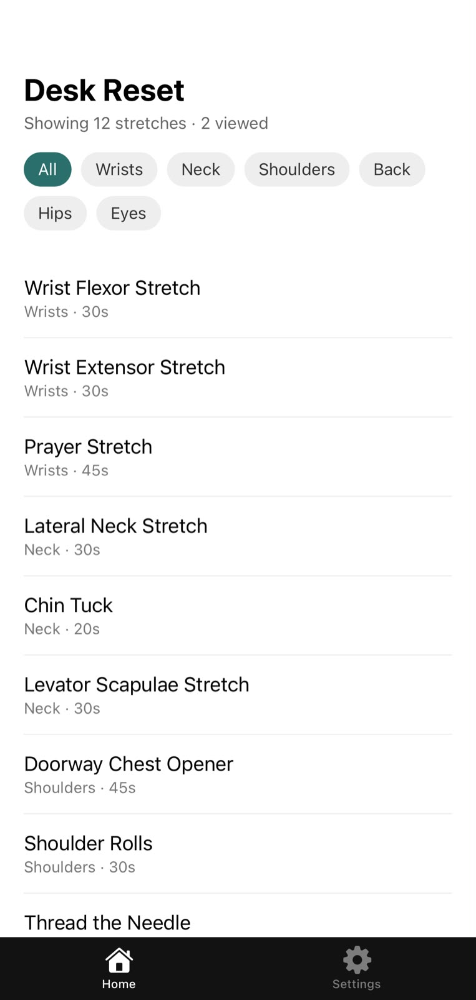
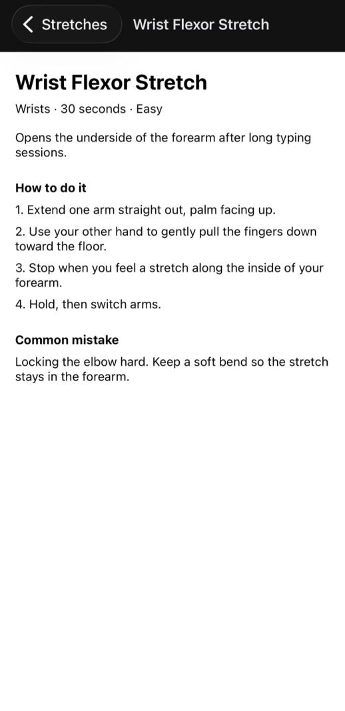
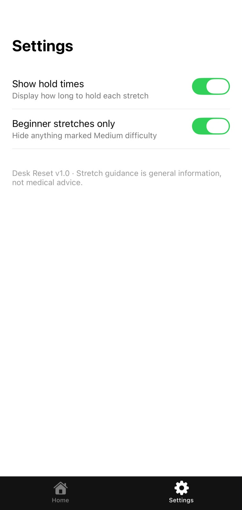

# Desk Reset

A React Native mobile application built with Expo for CSI2114.

## Target Domain

Health & Fitness - specifically workplace and screen-related musculoskeletal health.

## Problem Statement

This is for people who spend very long stretches at a screen. I'm at around 12 hours a day between addon production work and study.
This is because of my shoulder pain and numbness that builds over a working day.
In the past I tried physiotherapy, balms and ointments. The treatments themselves work; what fails is doing them consistently once I'm back at the desk.
I realized because it's an inconsistency problem rather than a knowledge problem, what's needed is something that makes the right stretch quick to find in the moment, not another long guide to read.

## How the App Solves It

Tapping "Shoulders" shows only shoulder stretches, so finding something relevant takes seconds. Connect it to your consistency point: the faster it is to find, the more likely you actually do it.
Numbered steps and a common mistake, so the stretch is done correctly rather than guessed at.
Each stretch states its duration, which removes the "how long is enough" question.
The app doesn't try to replace physiotherapy, it just lowers the effort of doing the right thing during a work session.

## Features

- Browse stretches organised by body area
- Filter by body area (Wrists, Neck, Shoulders, Back, Hips, Eyes)
- Detail view with step-by-step instructions, hold time, difficulty, and common mistakes
- Add, edit and delete stretches, stored on a REST API
- Works offline from a locally cached copy
- Settings screen with display preferences and cache controls

## Technical Implementation

- **Navigation:** Expo Router file-based routing. A root stack contains a tab group (Home, Settings); the detail screen is a dynamic route at `app/stretch/[id].tsx`, and the add/edit form is a modal route at `app/stretch-form.tsx`.
- **FlatList:** Renders the stretch list fetched from the API, with `keyExtractor` using each record's server-assigned `id`.
- **State:** A React context (`lib/stretches-store.js`) holds the list and exposes `loading`, `error` and `usingCache` flags plus the CRUD actions, so every screen reads the same data. Local `useState` hooks handle the area filter, the viewed counter, and the form fields.
- **Data:** Server-backed, with a local static array in `data/stretches.js` used to seed a fresh API resource.

## Sprint 2 - API and Persistence

### REST API

Stretch data lives on a MockAPI resource rather than in the app bundle.

| Method | Endpoint | Purpose |
| --- | --- | --- |
| GET | `/stretches` | Load the library |
| POST | `/stretches` | Add a stretch |
| PUT | `/stretches/:id` | Edit a stretch |
| DELETE | `/stretches/:id` | Remove a stretch |

All network calls go through `lib/api.js`, which wraps `fetch` with a shared timeout and status check. Screens never call `fetch` directly.

### Local persistence

After every successful load and every write, the stretch list is saved to AsyncStorage (`lib/storage.js`). If the server cannot be reached, the app falls back to that saved copy and shows an offline banner. If there is no saved copy either, an error screen with a retry button is shown instead.

### State management

`lib/stretches-store.js` holds the list in a React context so Home, Detail and the form screen all read and write the same data.

### Screens

- **Home** - filterable FlatList with loading, empty, error and offline states
- **Detail** - full instructions, with Edit and Delete
- **Add / Edit** - one form screen; creates with POST when opened without an id, updates with PUT when opened with one
- **Settings** - display toggles, cache status, clear cache, and restore the built-in stretches

## Setup Instructions

1. Clone the repository:
   `git clone https://github.com/NotSetonix/stretch-app.git`
2. Install dependencies:
   `npm install`
3. Create a MockAPI project at https://mockapi.io with a `stretches` resource
   (fields: name, area, seconds, difficulty, summary, steps, commonMistake).
4. Put your MockAPI base URL in `constants/api.js`.
5. Start the development server:
   `npx expo start`
6. Scan the QR code with Expo Go, or press `a` for an Android emulator.

On first run the resource is empty, so open **Settings > Restore default stretches** to upload the twelve built-in stretches.

Requires Node.js (LTS) and Expo Go.

## Screenshots

### Home

### Detail

### Settings

### Add / Edit

### Offline

### Empty state

### Loading

## Note

Stretch guidance in this app is general information, not medical advice.